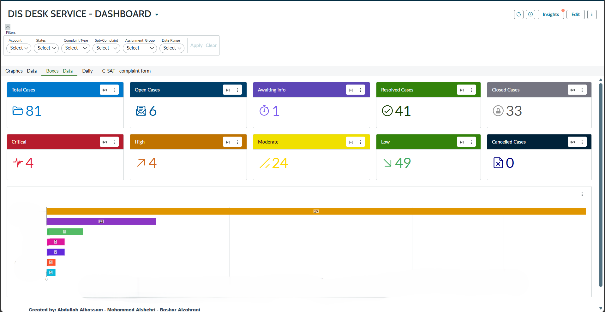

# 📊 ServiceNow Service Desk Performance Dashboard

A real-time ServiceNow dashboard designed to monitor incidents, track SLA compliance, analyze case severity, and improve service desk performance.

## 📌 Project Overview

This dashboard provides operational visibility into service desk activities and helps support teams make data-driven decisions through interactive reporting and analytics.

## 🎯 Objectives

- Improve incident visibility
- Monitor SLA compliance
- Track service desk performance
- Analyze workload distribution
- Support operational decision-making

## ✨ Features

- Incident Tracking
- Open & Closed Case Monitoring
- SLA Performance Metrics
- Case Severity Analysis
- Interactive Dashboard Visualizations
- Service Desk Performance Reporting

## 📊 Dashboard Metrics

- Total Cases
- Open Cases
- Closed Cases
- Critical Cases
- High Priority Cases
- Moderate Cases
- Low Priority Cases
- SLA Compliance Status

## 🛠️ Technologies Used

- ServiceNow
- IT Service Management (ITSM)
- Reporting & Analytics
- Performance Dashboards

## 📸 Screenshots

### Dashboard Overview

## 🚀 Business Impact

- Improved operational visibility
- Faster issue identification
- Better SLA management
- Enhanced service desk efficiency

## 👨‍💻 Author

Bashar Alzahrani
